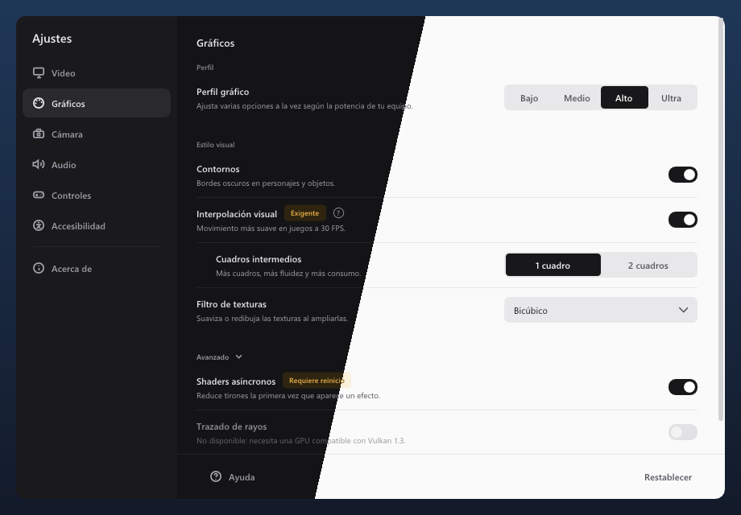
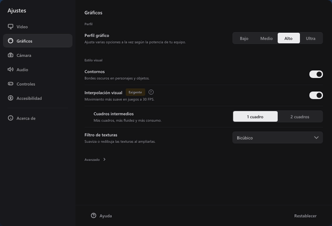
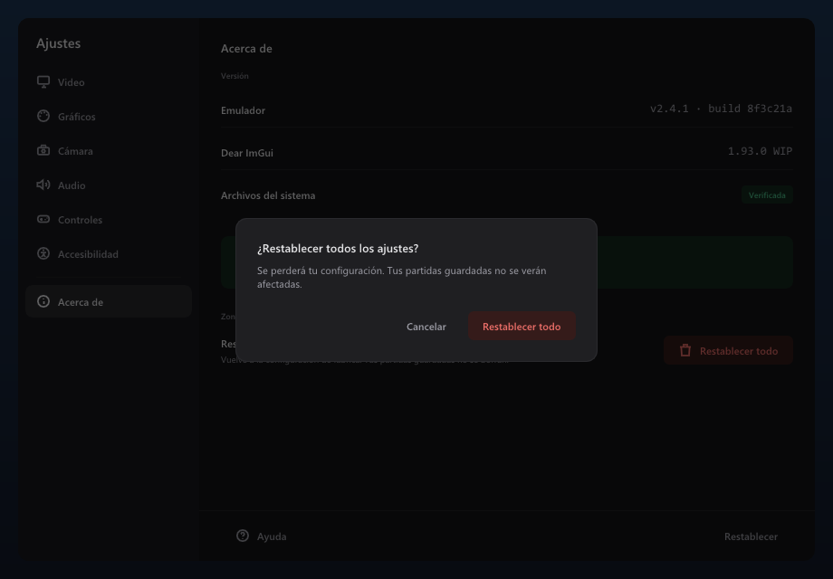
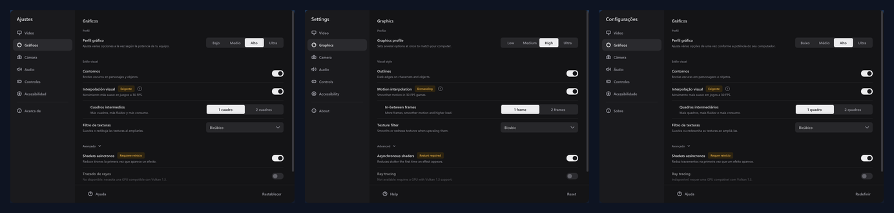

# ImGui Moderno

**Menús de ajustes claros y modernos para Dear ImGui**, pensados para emuladores, juegos y herramientas.

*Clean, modern settings menus for Dear ImGui: a monochrome theme (dark and light), ready-made widgets, smooth motion, built-in icons and Spanish / English / Portuguese support. Header-only, drop-in.*



Dear ImGui es rapidísimo para crear interfaces, pero lo que sale por defecto está pensado para desarrolladores: opciones amontonadas, casillas diminutas, nombres técnicos y un azul saturado que hoy se ve anticuado. Cuando esa interfaz llega a jugadores (el menú de un emulador, el instalador de un port, el overlay de un juego), cuesta entenderla.

**ImGui Moderno** es un sistema de diseño completo sobre Dear ImGui: un tema, widgets propios y una guía, para que cualquier proyecto tenga un menú de ajustes que se entienda a la primera, sin dejar de escribir código ImGui normal.

## Qué trae

- **Tema Grafito**, oscuro y claro. Grises neutros y un único acento monocromo; el color vivo queda solo para estados (correcto, advertencia, error).
- **Widgets pensados para ajustes**: interruptor, selector segmentado, desplegable, slider fino con lectura del valor, botones en cuatro variantes, insignias, avisos, tooltips y modal de confirmación.
- **Filas de ajuste**: etiqueta y descripción a la izquierda y control alineado a la derecha, con una sola llamada.
- **Ventana de ajustes completa**: barra lateral de categorías, contenido con scroll y barra de acciones con «Aplicar» solo cuando hay cambios.
- **Movimiento sutil**: la selección de la barra lateral y la pastilla del selector segmentado se deslizan al cambiar; el interruptor se anima. Todo en 120 ms, sin rebotes ni adornos.
- **Íconos incluidos**: íconos de línea para categorías y botones, dibujados por el propio sistema. No hace falta cargar ninguna fuente de íconos.
- **Tres idiomas**: español, inglés y portugués (Brasil), con cambio al momento. Los textos del sistema se traducen solos y tus textos usan `Tr("es", "en", "pt")`.
- **Escala y accesibilidad**: todo escala con el DPI (100 % a 200 %) y se usa con ratón, teclado y mando.
- **Header-only**: un archivo, `imgui_moderno.h`. Requiere Dear ImGui 1.92 o posterior.
- **Guía de diseño y de escritura** para que la interfaz no solo se vea bien, sino que también se lea bien.



| Modo oscuro | Modo claro |
|---|---|
|  |  |
| **Avisos con qué pasó, qué hacer y código** | **Confirmación antes de acciones destructivas** |
|  |  |

**Español, English, Português**: el idioma se cambia al momento desde *Accesibilidad*.



## Así se usa

```cpp
#include "imgui_moderno.h"

// Al iniciar, en lugar de ImGui::StyleColorsDark():
ImGuiModerno::LoadFonts("fonts/Inter-Regular.ttf", "fonts/Inter-Medium.ttf",
                        "fonts/Inter-SemiBold.ttf", "fonts/JetBrainsMono-Regular.ttf"); // opcional
ImGuiModerno::ApplyTheme(/*dark=*/true, /*dpi=*/main_scale);

// En tu menú:
if (ImGuiModerno::BeginSettingRows("##graficos")) {
    ImGuiModerno::SettingRow("Contornos", "Bordes oscuros en personajes y objetos.");
    ImGuiModerno::ToggleSwitch("##contornos", &cfg.outlines);

    ImGuiModerno::SettingRow("Campo de visión", "Amplía lo que ves a los lados.");
    ImGuiModerno::SliderFloat("##fov", &cfg.fov, 0.8f, 1.5f, "%.2fx", /*reset=*/1.0f);

    ImGuiModerno::SettingRow("Filtro de texturas", "Suaviza o redibuja las texturas al ampliarlas.");
    ImGuiModerno::Combo("##filtro", &cfg.filter, filtros, IM_ARRAYSIZE(filtros));
    ImGuiModerno::EndSettingRows();
}

// Íconos y varios idiomas:
ImGuiModerno::SidebarItem(ImGuiModerno::Tr("Gráficos", "Graphics", "Gráficos"), cat == 1, ImGuiModerno::Icon_Palette);
ImGuiModerno::SetLanguage(ImGuiModerno::Language_English);
```

Tus variables y tu lógica no cambian: solo cambia cómo se presentan.

## Pruébalo

El ejemplo [`examples/example_moderno_win32_directx11`](examples/example_moderno_win32_directx11/main.cpp) abre la ventana de ajustes de un emulador sobre una pantalla de juego simulada, con todos los componentes funcionando. Pulsa **F1** para mostrarla u ocultarla. En *Accesibilidad* puedes cambiar idioma, tema y tamaño de interfaz al momento.

Con Visual Studio, desde una *Developer Command Prompt*:

```bat
cd examples\example_moderno_win32_directx11
build_win32.bat
Debug\example_moderno_win32_directx11.exe
```

Para integrarlo en tu proyecto, copia `misc/moderno/imgui_moderno.h` junto a tus archivos de Dear ImGui (y `imgui_moderno_demo.cpp` si quieres la demo).

## Documentación

| | |
|---|---|
| [Cómo empezar](misc/moderno/README.md) | Integración, fuentes y ejemplos |
| [Referencia de la API](misc/moderno/docs/api.md) | Cada función, con ejemplos y errores comunes |
| [Guía de diseño](misc/moderno/docs/guia.md) | Principios, layout, organización, tipografía, color, íconos, movimiento y escritura |
| [Medidas](misc/moderno/docs/medidas.md) | Padding, espaciado y alturas de cada componente |
| [Componentes](misc/moderno/docs/componentes/) | Una ficha por componente |
| [Tokens](misc/moderno/tokens.json) | Todos los valores del sistema en JSON |

## Con asistentes de IA

[`misc/moderno/AGENTS.md`](misc/moderno/AGENTS.md) reúne todo lo que un asistente (Claude Code, Codex, Cursor, Copilot…) necesita para aplicar el sistema correctamente o migrar una interfaz existente: reglas, qué control usar en cada caso, cómo escribir los textos, errores a evitar y una lista de verificación final. Apunta tu asistente a ese archivo y pídele, por ejemplo: «Aplica ImGui Moderno al menú de ajustes».

## Estado

En desarrollo. El tema, los widgets, las animaciones, los íconos y los tres idiomas están completos y se probaron con el ejemplo de Windows + DirectX 11.

Próximos pasos:

- Marca de «modificado» en cada fila, con restablecer por ajuste.
- Foco de mando propio, que se desliza entre controles.
- Ejemplos para SDL y GLFW.
- Más idiomas (chino, japonés, ruso), que necesitan fuentes con esos alfabetos.

## Créditos y licencia

Este repositorio es un fork de [Dear ImGui](https://github.com/ocornut/imgui), de Omar Cornut, distribuido bajo licencia MIT (ver [LICENSE.txt](LICENSE.txt)). El README original de Dear ImGui está en [docs/README.md](docs/README.md).

ImGui Moderno (todo lo que hay en `misc/moderno/` y el ejemplo `example_moderno_win32_directx11`) es © 2026 AcheOsspar, también bajo licencia MIT (ver [misc/moderno/LICENSE](misc/moderno/LICENSE)). Si lo usas en tu proyecto, conserva ambos avisos de copyright: el de Dear ImGui y el de ImGui Moderno.

ImGui Moderno usa Inter y JetBrains Mono (SIL Open Font License), que no se incluyen en el repositorio.
